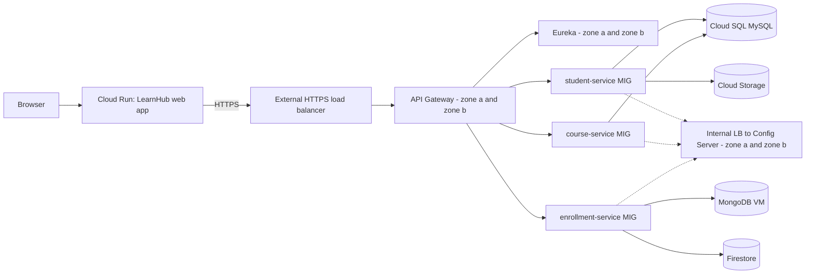

# LearnHub - Backend Services (parent repository)

Super repository of the LearnHub **business microservices**: student, course and enrollment services as Git submodules.

## Student Information

- **Student Name:** M.W. Oshan Shanuka
- **Student Number:** 2301692025
- **Slack Handle:** oshan_shanuka
- **GCP Project ID:** learnhub-capstone

Final project of **ITS 2130 Enterprise Cloud Architecture** (Higher Diploma in Software Engineering, IJSE).

## Project Description

Three homogeneous Spring Boot microservices, each in its own repository and linked here as **Git submodules**:

| Submodule (folder) | Repository | Data |
|---|---|---|
| `student-service` | [`learnhub-student-service`](https://github.com/iamoshanshanuka/learnhub-student-service) | MySQL (Cloud SQL) + Cloud Storage photos |
| `course-service` | [`learnhub-course-service`](https://github.com/iamoshanshanuka/learnhub-course-service) | MySQL (Cloud SQL) |
| `enrollment-service` | [`learnhub-enrollment-service`](https://github.com/iamoshanshanuka/learnhub-enrollment-service) | MongoDB + Firestore activity log |

Both a **relational** database (MySQL) and a **non-relational** database (MongoDB) are used. The enrollment service calls the other two through Eureka, which shows real inter-service communication.
The platform tier is in [`learnhub-backend-platform`](https://github.com/iamoshanshanuka/learnhub-backend-platform); the web application is in [`learnhub-frontend-web`](https://github.com/iamoshanshanuka/learnhub-frontend-web).

### Architecture



### Auto scaling

Every service runs in a **regional Managed Instance Group** built from an instance template: at least 2 VMs spread over the zones, up to 3, scaling at 60 percent CPU, with auto-healing on `/actuator/health`. PM2 restarts a crashed process and starts again after a reboot.

## Technology Stack

- Java 25
- Spring Boot 4.0.7 and Spring Cloud 2025.1.2
- Spring Data JPA (MySQL 8 on Cloud SQL) and Spring Data MongoDB (MongoDB 8)
- Google Cloud Storage and Firestore client libraries
- Spring Cloud Netflix Eureka Client, LoadBalancer, Config Client
- PM2 on Compute Engine (managed instance groups, instance templates, custom disk image, health checks)

## Setup / Getting Started

```bash
git clone --recurse-submodules https://github.com/iamoshanshanuka/learnhub-backend-services.git
cd learnhub-backend-services
# already cloned without submodules?   git submodule update --init --recursive
```

Start the platform first ([`learnhub-backend-platform`](https://github.com/iamoshanshanuka/learnhub-backend-platform): Eureka and Config Server), then (JDK 25 and Maven 3.9+ required; details in each submodule's README):

```bash
(cd student-service    && mvn clean package && java -jar target/student-service.jar) &      # 8081, MySQL needed
(cd course-service     && mvn clean package && java -jar target/course-service.jar) &       # 8082, MySQL needed
(cd enrollment-service && mvn clean package && java -jar target/enrollment-service.jar)     # 8083, MongoDB needed
```

Deployment on Google Cloud (summary): each service has an instance template whose startup script downloads the newest jar from a private bucket and starts it with PM2; database passwords are random and passed as instance metadata. GCP project: `learnhub-capstone`.
